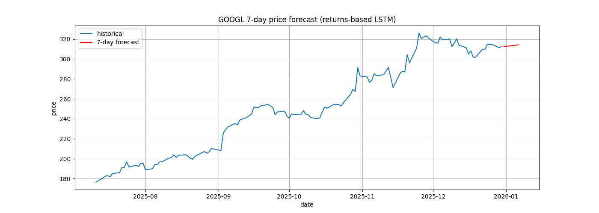

# Time Series Forecasting using LSTM & PyTorch

## Overview

This project implements a **returns-based LSTM model** to analyze and forecast short-term movements in financial time series data.
Instead of predicting raw prices, the model learns from **daily log-returns**, which are more appropriate for financial time series due to their stationarity.

The objective is **not to claim high predictability**, but to demonstrate a **methodologically correct and realistic time-series modeling pipeline using PyTorch**.

---

```
project-root/
├── gfc.py
├── google_time_series_prediction.png
├── README.md
```

## Why Log-Returns Instead of Prices?

Stock prices are:

* Non-stationary
* Trend-dominated
* Scale-dependent over long horizons

Predicting raw prices often leads to **misleadingly high R² values** caused by trend leakage.

To avoid this:

* Daily **log-returns** are used as the prediction target
* This ensures stationarity and prevents artificial inflation of performance metrics

---

## Data

* **Example Dataset:** Google (GOOGL) stock prices
* **Source:** Yahoo Finance (`yfinance`)
* **Time Period:** January 2000 – Present
* **Feature:** Daily Open price → converted to log-returns

---

## Data Splitting Strategy

A **chronological split** is used to reflect real forecasting conditions:

* **60% Training**
* **20% Validation**
* **20% Test**

Random shuffling is intentionally avoided to prevent **look-ahead bias** and data leakage.

---

## Model Architecture

* **Model:** LSTM (Long Short-Term Memory)
* **Framework:** PyTorch
* **Input:** Rolling window of past 60 daily log-returns
* **Layers:**

  * 2-layer LSTM (hidden size = 32)
  * Dropout for regularization
  * Fully connected output layer
* **Loss Function:** Mean Squared Error (MSE)
* **Optimizer:** Adam
* **Training Control:** Early stopping based on validation loss

The architecture is intentionally kept compact to favor **generalization over overfitting**.

---

## Evaluation Metrics

Because the model predicts **continuous returns**, regression metrics are used:

* **RMSE (Root Mean Squared Error)** on returns
* **R² (Coefficient of Determination)** on returns

> In financial time series, daily returns are highly noisy.
> Therefore, **small but positive R² values are expected and realistic**.

### Sample Test Performance

* **RMSE (returns):** ~0.020
* **R² (returns):** ~0.005

This indicates a **genuine predictive signal**, consistent with real-world financial data.

The figure below shows the 7-day price forecast reconstructed from predicted log-returns.



---

## Forecasting

The trained model is used to generate a **7-day forward forecast**:

1. Predict future log-returns recursively
2. Reconstruct values from predicted returns
3. Visualize predictions alongside recent historical data

A 7-day horizon is chosen because predictive signal degrades rapidly over longer horizons in daily data.

---

## Visualization

The final output includes:

* Recent historical time-series trajectory
* 7-day forecast reconstructed from predicted returns

The forecast is intentionally smooth and conservative, avoiding unrealistic jumps.

---

## Key Takeaways

* Emphasis on **methodological correctness** over inflated metrics
* Evaluation aligned with realistic properties of time-series data
* Avoids common pitfalls such as:

  * Data leakage
  * Trend memorization
  * Overfitting to noise

---

## Disclaimer

This project is for **educational and analytical purposes only** and does not constitute financial advice.

---

## Author

**Pawan Kumar Chaurasia**
